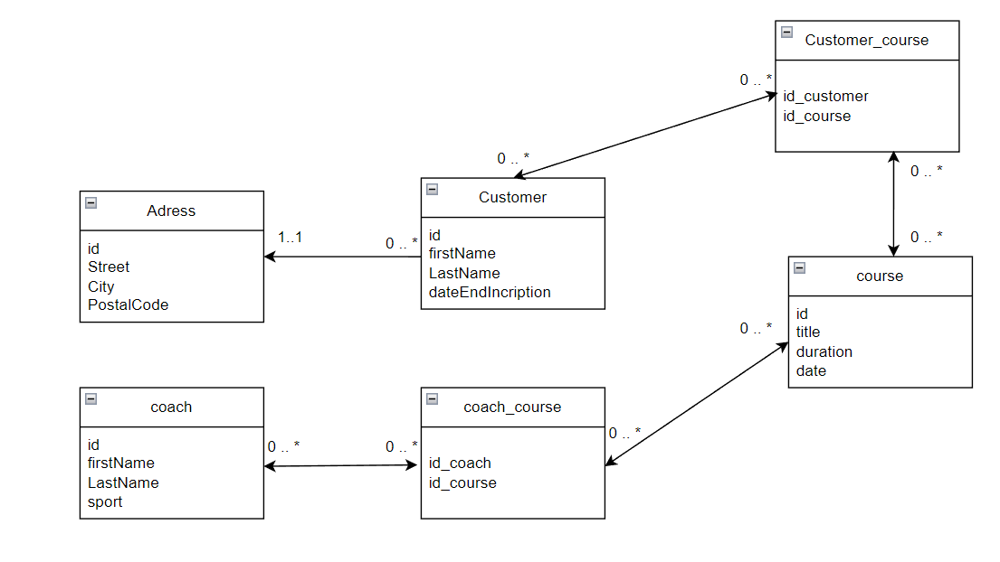

# ECF 2 : Application de gestion d'une salle de sport 

---

## Entitées :

>Personn :
>>- <ins>**attribut:**<ins/>
>>- id (int)
>>- firstName (string)
>>- lastName (string)

<br/>

>customer inherit from Personn:
>>- <ins>**attribut:**<ins/>
>>- dateEndIncription (date)
>>- courses (list de course)
>
>>- <ins>**methodes:**<ins/>
>>- addCourse
>>- removeCourse

<br/>

>Address :
>>- <ins>**attribut:**<ins/>
>>- id (int)
>>- street (string)
>>- city (string)
>>- postalCode (string)

<br/>

>Course :
>>- <ins>**attribut:**<ins/>
>>- id (int)
>>- title (String)
>>- duration (int)
>>- date (date)
>>- place (int)
>>- customers (list customer)
>>- coachs (list coach)
>
>>- <ins>**methodes:**<ins/>
>>- addCustomer
>>- removeCustomer

<br/>

>Coach inherit from Personn:
>>- <ins>**attribut:**<ins/>
>>- sport (string)
>>- courses (list course)
>
>>- <ins>**methodes:**<ins/>
>>- addCourse
>>- removeCourse
---

## MLD de la base de donnée :


---

## Service :
utilisation du repository pattern pour harmoniser les different service et avoir dans chacun le CRUD de base.
(create, delete, update, findById, findAll)

### CustomerService :
methodes additionelles pour créer les adresses, et rechercher une adresse par son nom de rue, son nom de ville et son code postal pour eviter les doublon en base de donnée.

### CourseService :
méthode additionelle pour aller chercher les cours qui sont a venir (qui ne sont pas encore passé).

### CoachService :
aucune méthode additionelle.

---

## IHM :
### Menu :
```
        -------- menu --------
        1-- ajouter un clients
        2-- supprimer un client
        3-- modifier un client
        4-- afficher tout les clients
        5-- inscrire un client a un cours
        ----------------
        6-- creation d'un cours
        7-- suppresion d'un cours
        8-- modification d'un cours
        ----------------
        9-- creation d'un coach
        10-- suppresion d'un coach
        11-- modification d'un coach
        12-- ajout d'un coach a un cours
        ----------------
        13-- afficher tout les cours a venir
        14-- afficher tout les cours d'un client a venir
        15-- afficher tout les cours d'un coach a venir
        ----------------
        16-- supprimer un client d'un cours
        17-- supprimer un coach d'un cours
```

- 1 à 4: CRUD du Customer (lors de la creation du client on a la possibilité de crée l'addresse ou si elle existe deja de liée se client a cette addresse).
- 5 : Ajout d'un clients a un cours lors de l'ajout du client au cours on verifie si le client a un abonement actif a la date du cours et si le cours n'est pas encore passé et si le cours a encore des places de libre.
- 6 à 8 : creation, suppresion et modification du Course.
- 9 à 11 : creation, suppresion et modification du Coach.
- 12 : Ajout du coach a un cours lors de l'ajout on verifie que le cours n'est pas deja passé.
- 13-14-15 : fonction d'affichage des cours en fonction de l'entitée voulu.
- 16 : permet de retirer un client d'un cours si il y etait inscrit et de liberer sa place.
- 17 permet de retirer un coach d'un cours si il y etait inscrit.